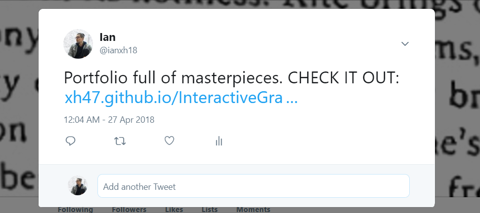

# Interactive Graphics Portfolio

CHECK IT OUT HERE: https://xh47.github.io/InteractiveGraphicsPortfolio/

# Blog Post

This semester was quite an enjoyable learning experience. I was blessed with being able to merge together the creative and artistic side of an academic education with the mind rattling programming concepts I have previously dabbled in. Not only was it challenging to me, it was also so refreshing in a very good way. While I did not struggle much with the coding, interaction, and engineering aspects of the course, I did very much so with the artistic and design side of things. The task of creating and polishing an art piece was more challenging and time-consuming than expected, and I found myself going back and updating/improving previous works versus starting new works from scratch to avoid the more difficult imaginative process. I thought the connecting things project was very limiting, since physical interaction has a much smaller scope with respect to art. I felt usually physical aspects were hard to integrate into artworks based on programming/coding. However it did force me to think creativly and be imaginitive for that piece. Overally, I think the class broadened my skillset as a software developer. With improved creativity, design, and interaction skills in coding, I will have important tools to tackle challenges that I may face in the future.
